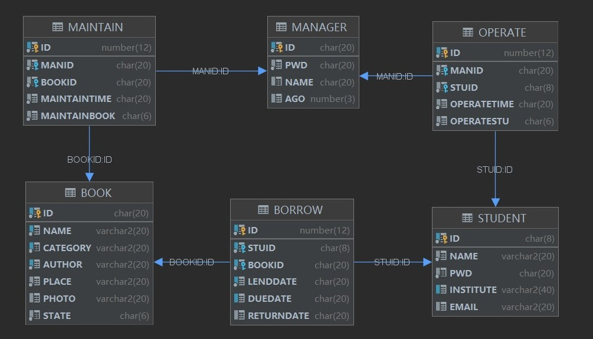

# 图书馆管理系统

### 1 功能模块

C/S  (Client/Server) ：

B/S  (Browser/Server)：

### 2 实验环境

数据库：Oracle 11g

数据库操作工具：PL/SQL Developer

编程语言：JAVA

JDK版本：JDK 1.8

编译器：Intellij IDEA

服务器：Tomcat 9.0.48

### 3 数据库表设计

 

